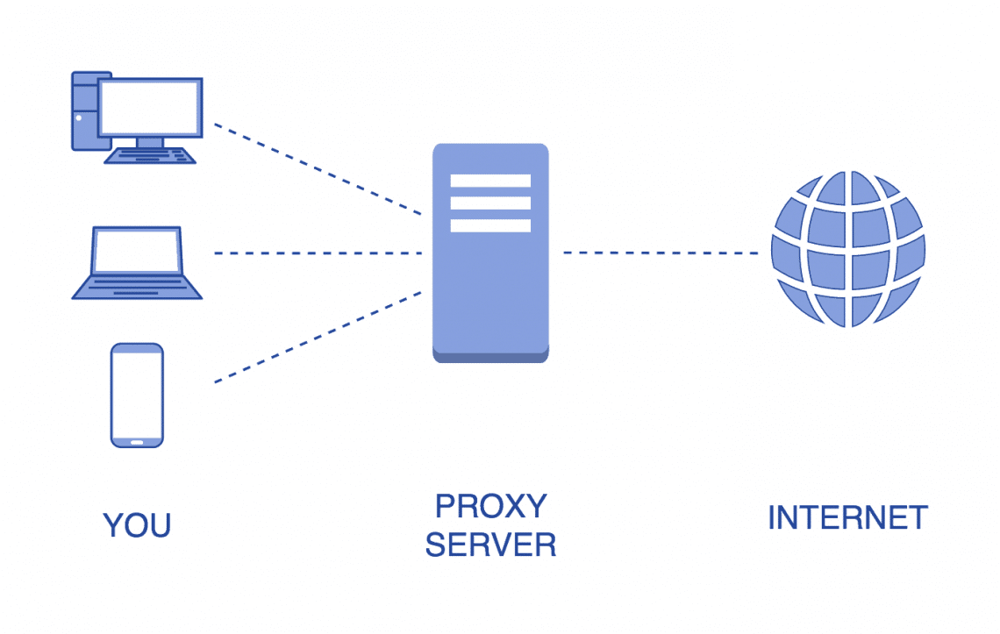
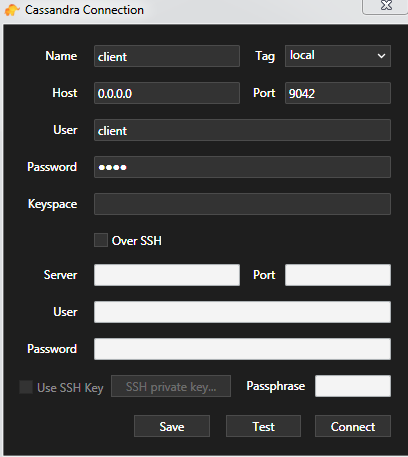
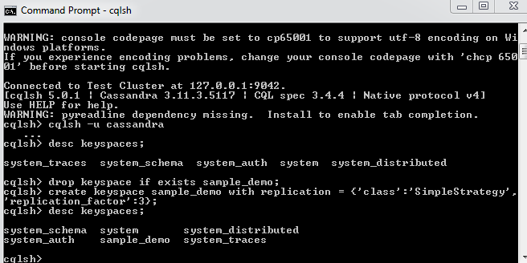
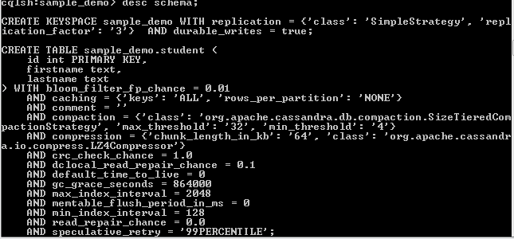

# 
 Laboratory 2 

# 
 Programming Distributed Applications 

## 
 Building a distributed system 

#### Microservices Are Distributed Systems
The original definition of a distributed system is: 
"A distributed system is a model in which components 
located on networked computers communicate and coordinate 
their actions by passing messages." (Wikipedia) And this is
exactly what happens in microservices-based architectures.

The individual services are deployed to cloud instances,
physically running somewhere as they exchange messages.
This is a big difference to how we used to build centralized applications. 
Instead of having a bunch of servers in our datacenter that 
handle all kinds of synchronization, transactions, and failover 
scenarios on our behalf, we now have individual services that evolve 
independently and aren't tied to each other. There are some fundamental
challenges that are unique to distributed computing. Among them are fault
tolerance, synchronization, self-healing, backpressure, network splits, and much more.

To perform the task it is advisable to use the Docker container, Docker Compose.
DB Cassandra is proposed for the database role. 

**Docker** - Docker is a set of platform as a service products that use
OS-level virtualization to deliver software in packages called containers. 
Containers are isolated from one another and bundle their own software, 
libraries and configuration files; they can communicate with each other through well-defined channels.

**Docker Compose** - is used to run multiple containers as a single service. 
For example, suppose you had an application which required NGNIX and MySQL, 
you could create one file which would start both the containers as a service without the need to start each one separately.

**Cassandra** - Apache Cassandra is a free and open-source, distributed,
wide column store, NoSQL database management system designed to handle large
amounts of data across many commodity servers, providing high availability with no single point of failure. 

Because we have limited resources and lack of necessary operating system, our goal 
was to install Cassandra on our computer through a server instance and create two routes: one for reading and one for writing.

#### Installing the Cassandra instance on the local computer
  
  
  
  

To create the read and write routes in the created tables we used the Java programming language
